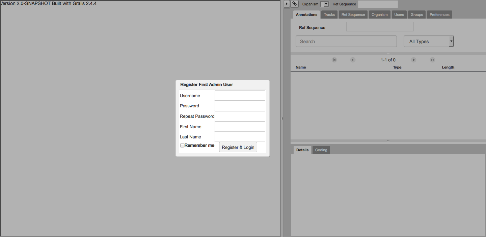
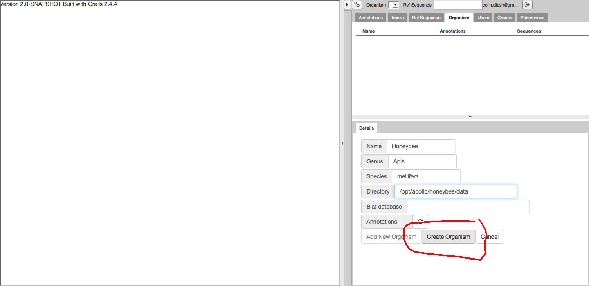

# Database setup

View <a href="https://github.com/GMOD/Apollo/blob/master/docs/Database_setup.md">On GitHub</a>

Web Apollo 2.0 simplifies and expands options for the database setup. This section will cover the basic options for this.

### Options

- H2 database - an embedded in-memory zero-configuration database
- PostgreSQL - an established database system that is popular for Chado compatibility
- MySQL - an established database system that has familiarity in the PHP community

### Create new postgres user (optional)

    $ sudo su postgres # unneeded for some systems (e.g. homebrew)
    $ createuser -P web_apollo_users_admin
    Enter password for new role: 
    Enter it again: 
    Shall the new role be a superuser? (y/n) n
    Shall the new role be allowed to create databases? (y/n) y
    Shall the new role be allowed to create more new roles? (y/n) n

### Create new authentication database

Now we can create a new database that is owned by the web_apollo_users_admin user. We will use the "-h localhost" flag to force host based authentication instead of peer authentication.

    $ createdb -U web_apollo_users_admin web_apollo_users -h localhost

### Login to the web interface

You will be prompted for login information

Then you can proceed to navigate to the organism panel and enter the location of the JBrowse data store for your particular organism.

### Finished

Note that we're only using a subset of the options for all the scripts
mentioned above. You can get more detailed information on any given
script (and other available options) using the "-h" or "--help" flag
when running the script.

